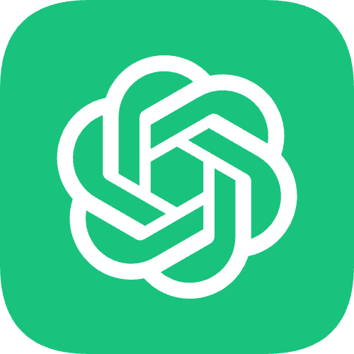
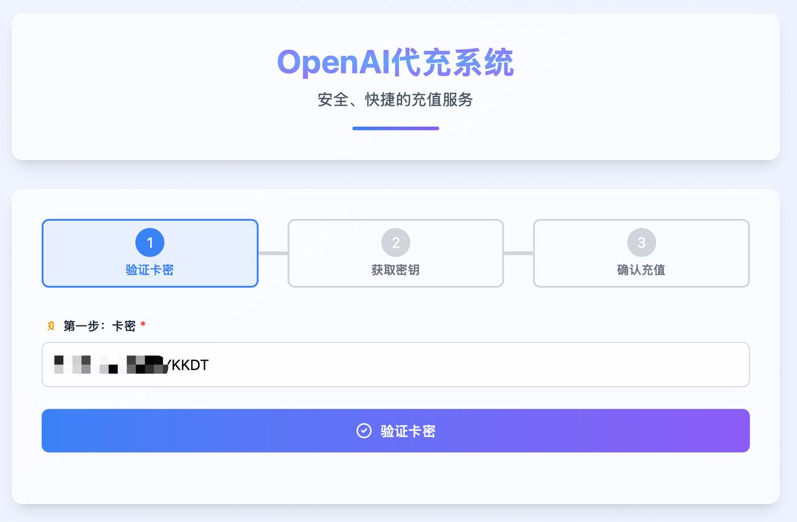
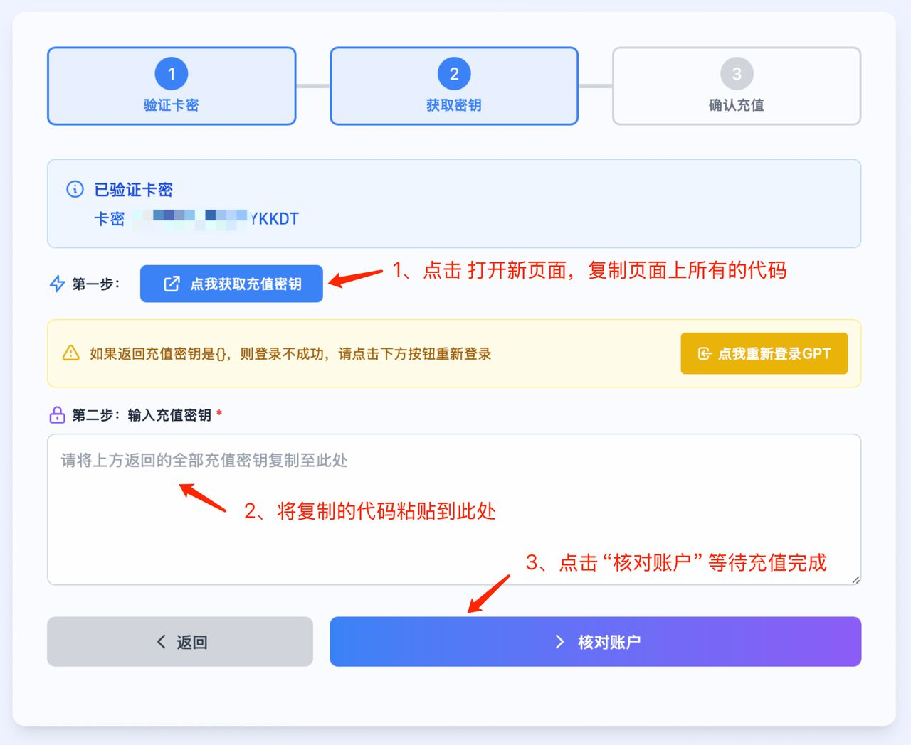
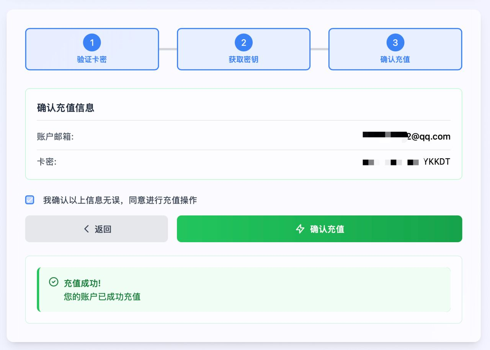
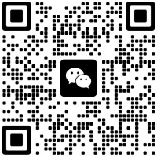

  

# 如何低价自动充值 OpenAI ChatGPT Plus 会员

使用SSL安全加密协议，全程自助充值，无需信用卡，仅需卡密，30秒完成充值。

  
  

## 什么是OpenAI Plus自助充值？

通过我们的自助充值系统，您将会收到卡密，通过我们的自助充值网站快速充值，在登陆好OpenAi账号的情况下 仅需30秒即可充值完成。无需信用卡，效率更高、更安全！

充值价格：使用尼区充值，价格远低于官方plus定价。

## 注意事项

1. 自助充值，您首先要有自己的GPT账号，没有账号可联系我们购买成品账号
2. 您的gpt账号当前没有开通过plus、或者plus已经过期才能充值续费。
3. 尽量选择美国、日本、新加坡等节点进行登陆您的GPT账号。
4. 只要没充值成功，卡密就不会过期，可囤货。
5. 如果充值失败，可能网络等问题，可以重试充值。失败两次就不要频繁重试，大概率是ip不干净被OpenAI拒绝了，可换个干净的ip节点再重试，或者联系客服协助。

## 使用教程

1. 下单成功您将会在卡密中看到充值密钥，复制并打开我们的充值网站 粘贴卡密，点击 “验证卡密”

2. 登陆您的OpenAI账户并点击“我已登陆”，然后出现如下页面，按步骤操作即可。

3. 核对账户后开始自动充值。

出现充值成功提示信息，说明已经充值完成！

## 售后服务

有效期内全程质保，中途掉的或者封号的按使用天数退余额或补差价开新号。

封号将优先补差价换新号方案，或者按规定质保时间剩余天数退钱，(退钱比例：订单金额/30 = 每天金额 * 剩余天数 进行退款)

1个月的套餐到期后可继续续费。

## 联系我们

微信：api-gpt

